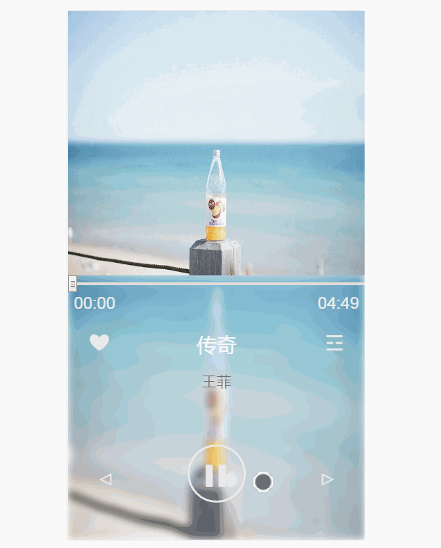

# music-player
#### 基于H5的SPA音乐播放器  

###### 不依赖任何框架、基于原生HTML5与ECMAScript 6的新特性开发出音乐播放器。
###### 基于CSS3新特性translate、animation等，运用高斯模糊渲染播放器背景，只需导入歌曲信息即可自动渲染播放器。
###### 实现播放器大部分功能 : 播放、暂停、切换音乐、更改音乐进度、循环播放、查看播放列表、收藏
